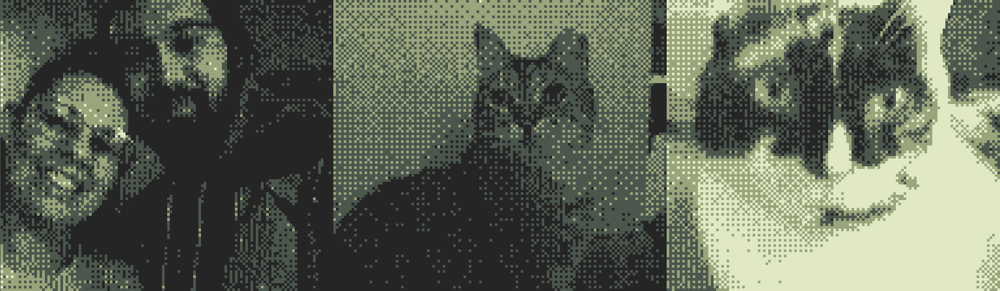

# Butano GBA Tutorial Series - A ~~Complete~~ WIP Guide to Game Boy Advance Homebrew Development

[](https://buymeacoffee.com/breadcodes)

This series was a labor of love and many late nights. I'd like to dedicate this series to my fiance, and my cats, Rupee and Korra

[](https://buymeacoffee.com/breadcodes)

## Learn GBA Game Development with Butano Framework

A comprehensive Game Boy Advance (GBA) development tutorial series using the Butano C/C++ framework. Perfect for beginners looking to get started with GBA homebrew development, this series will teach you how to build games for the Game Boy Advance.

### What is Butano?

Butano is a modern C++ high-level engine/framework for GBA homebrew development that simplifies sprite management, background tiles, audio, and other GBA hardware features. This tutorial series covers everything from environment setup with DevKitPro's DevKitARM (or, optionally, Wonderful Toolchain) to building a complete puzzle game.

### What You'll Learn

This series covers all essential GBA development concepts including:

- **GBA Sprites** - Regular sprites, affine sprites, and sprite animations
- **Background Tiles** - Regular backgrounds, affine backgrounds, and tilemap management
- **Game Loop Architecture** - Scene management and state handling
- **Entity Management** - Collision detection, object pooling, and game entities
- **GBA Input Handling** - D-pad & buttons
- **GBA Audio** - Music playback and sound effects, in Tracker formats (`.it`, `.vgm`, `.mod`, `.s3m`, `.xm`, etc)
- **C/C++ Game Development** - Modern C++ patterns for embedded systems
- **DevKitPro Toolchain** - Building and debugging GBA ROMs

### Tutorial Series Overview

Each chapter builds upon the previous, teaching you to create a complete **Klotski sliding block puzzle game** for the GBA. All chapters available at [bread.codes](https://bread.codes):

#### [Chapter 0: Introductions and Overview](https://bread.codes/posts/butano-series-0)

Introduction to the Butano tutorial series, what we'll be building, and an overview of the Butano engine for GBA development.

**Topics:** Series overview, Butano introduction, intended audience, GBA homebrew basics

#### [Chapter 1: Setting Up Your Development Environment](https://bread.codes/posts/butano-series-1)

Set up your GBA development environment with DevKitPro, install the toolchain, configure your IDE, and build your first GBA ROM.

**Topics:** DevKitPro installation, mGBA emulator setup, cloning the starter repository, building your first GBA project, IDE configuration (VS Code, Zed, CLion)

#### [Chapter 1.1: A Detour for Additional Tools] (WIP)

Select additional tools for creating art and music. I also cover additional IDEs, Wonderful Toolcahin as an alternative to DevKitPro, and other alternatives you may choose for your adventure.

**Topics:** Covers the alternatives for everything in Chapter 1

#### [Chapter 2: Sprites in Butano] (WIP)

Learn how to create pixel art sprites in Aseprite and import them into your GBA game using Butano's sprite system.

**Topics:** Creating sprites in Aseprite, importing sprites to Butano, sprite rendering, sprite positioning, GBA sprite limitations

#### [Chapter 3: Scenes and Game Loop] (WIP)

Implement a game loop architecture and scene management system for organizing game states and transitions.

**Topics:** Game loop fundamentals, scene architecture, scene switching, state management, VBlank and frame timing

#### [Chapter 4: Entity Management] (WIP)

Build a robust entity management system with collision detection for game objects like blocks and cursors.

**Topics:** Entity creation and lifecycle, collision detection, movement constraints, input handling, game object management

#### [Chapter 5: Backgrounds and Tiles] (WIP)

Create GBA background tiles and tilesets, implement title screens, and build game containers using background layers.

**Topics:** BG tiles, regular backgrounds, tilemap creation, background rendering, layering backgrounds and sprites

#### [Chapter 6: Win Condition] (WIP)

Implement game logic for detecting puzzle completion and handling win states.

**Topics:** Game state logic, win condition detection, level completion

#### [Chapter 7: Level Systems] (WIP)

Design and implement a level loading system with multiple puzzle configurations.

**Topics:** Level data structures, level loading, level progression, puzzle generation

#### [Chapter 8: Menus and UI] (WIP)

Create GBA user interfaces with menus, text rendering, and navigation systems.

**Topics:** Menu systems, font rendering, UI navigation, text display on GBA

#### [Chapter 9: Credits and Polish] (WIP)

Add finishing touches including credits screens, audio integration, and game polish.

**Topics:** Credits implementation, audio/music integration, sound effects, final polish

### Getting Started

If you're here for a bootstrapped Butano project template, use `chapter-1-getting-started` as your starting point (MIT licensed).

If you aren't here to follow the series **and you have your environment set up already**, you can run the following commands to build your first ROM:

```bash
# Clone this repository
git clone https://github.com/breadbored/butano-tutorial-series.git
cd butano-tutorial-series

# Initialize Butano submodules
git submodule update --init --recursive

# Navigate to the starter chapter
cd chapter-1-getting-started

# Build your first GBA ROM
make

# Run in mGBA emulator
make run
```

---

## Support the Series

If you find this tutorial series helpful, consider supporting the project:

[](https://buymeacoffee.com/breadcodes)

---

### License

This series is licensed under a [Creative Commons Attribution-NonCommercial 4.0 International License](https://creativecommons.org/licenses/by-nc/4.0/).

The purpose of this license is to allow you to share this series freely, as long as you attribute BreadCodes as the original author, and do not commercialize the content through paid courses, books, or other means.

The project repository for this series is almost entirely licensed under the same license.  
The exception is `chapter-1-getting-started/LICENSE`, which is licensed under the [MIT License](https://opensource.org/licenses/MIT) to allow for more flexibility when using the starter code for your own projects.  
This project uses 3rd party assets which may have different licenses; please refer to the `LICENSE` file in that directory for more information.
